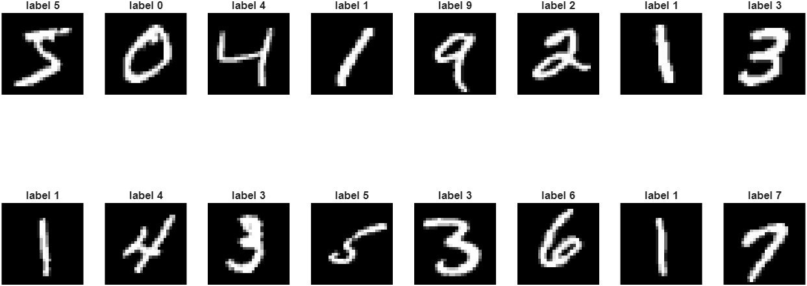
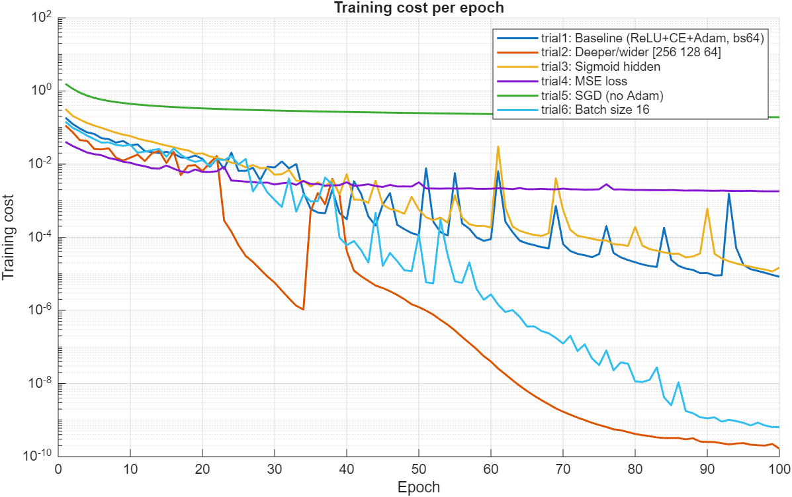
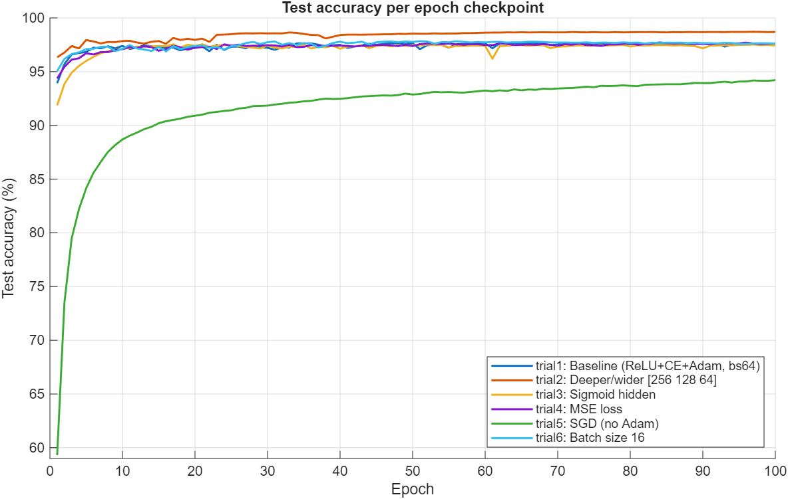
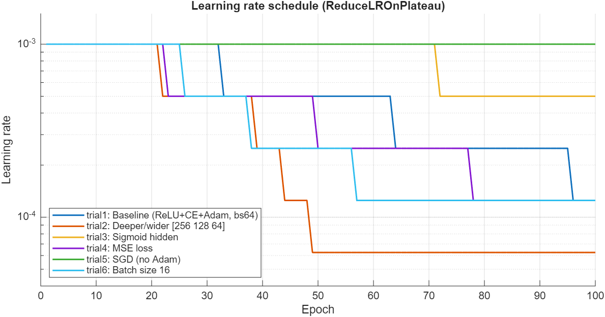
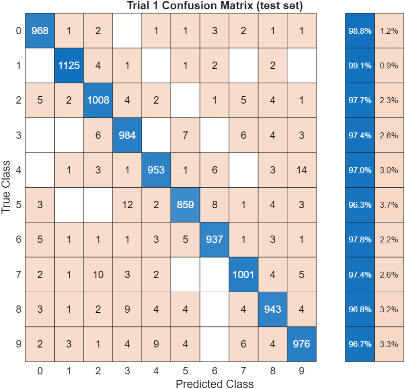
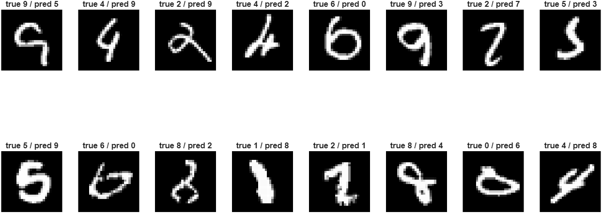

# 以 MATLAB 從零實作深度神經網路：MNIST 手寫數字辨識

國立中央大學 理學院學士班 黃翊哲

---

## 摘要

本專題在 MATLAB 中從零實作一個深度神經網路（Deep Neural Network, DNN），用於 MNIST 手寫數字分類。實作內容涵蓋前向傳播、反向傳播（手動推導梯度）、mini-batch 梯度下降、Adam 優化器、學習率衰減（ReduceLROnPlateau）、GPU 加速與訓練中斷續跑機制，**不使用任何深度學習框架的網路定義或自動微分（automatic differentiation）**。

我們設計 6 組對照實驗，每組只改變一個因素，分別探討網路深度與寬度、活化函數、損失函數、優化器與批次大小對分類表現的影響。基準模型（`784-64-32-10`）測試準確率為 **97.54%**；加深加寬的模型（`784-256-128-64-10`）達到 **98.70%**，為所有實驗中最佳；純 SGD 在相同訓練預算下只有 **94.21%**。實驗結果與深度學習的常見實務經驗一致，也從側面驗證了手動推導的反向傳播是正確的。

---

## 1. 研究動機與價值

### 1.1 手寫數字辨識問題

手寫數字辨識是電腦視覺與圖形辨識領域的經典問題。本專題使用 **MNIST** [5] 資料集，共 70,000 張 0～9 的手寫數字灰階影像，其中 60,000 張用於訓練、10,000 張用於測試，每張影像為 28×28 像素。目標是建立一個模型，輸入一張 28×28 的灰階影像，正確判斷它屬於 10 個數字類別中的哪一個。

這個問題的輸入維度高（784 維），而且不同人的書寫風格差異很大，因此常被當作評估機器學習與深度學習模型的標準基準（benchmark）。



*圖 1：MNIST 訓練集樣本。每張影像為 28×28 灰階，上方為標籤。*

### 1.2 為什麼使用深度神經網路

線性分類器只能在輸入空間中畫出直線（超平面）邊界，難以處理手寫字跡這種高度非線性的資料。DNN 透過堆疊多層神經元與非線性活化函數，可以直接從原始像素逐層學習越來越抽象的特徵表示，把高維影像空間映射到對應的數字類別。

### 1.3 為什麼要從零實作

PyTorch、TensorFlow、MATLAB Deep Learning Toolbox 等框架只要幾行程式就能訓練神經網路，反向傳播交給框架的自動微分處理。這很方便，但也讓「網路究竟如何學習」變成黑盒子。本專題刻意不使用自動微分，目的在於：

1. **理解反向傳播的數學本質**：每一層的梯度都必須親手由連鎖律推導，再寫成向量化的矩陣運算。
2. **理解訓練技巧的作用**：權重初始化、Adam、學習率排程、mini-batch 這些框架「預設值」各自在解決什麼問題，親手實作後再用對照實驗驗證。
3. **面對工程問題**：數值穩定性（softmax 溢位、`log(0)`）、GPU 精度與記憶體、長時間訓練的中斷續跑等問題，在使用框架時通常不會注意到。

---

## 2. 研究方法

### 2.1 開發環境與使用套件

| 項目 | 內容 |
|---|---|
| 語言／平台 | MATLAB |
| GPU 加速 | **Parallel Computing Toolbox**：`gpuDevice`、`gpuArray`、`gather` |
| 評估與繪圖 | MATLAB 內建繪圖函式；混淆矩陣使用 **Statistics and Machine Learning Toolbox** 的 `confusionmat`／`confusionchart`（只用於評估腳本 `evaluate_all.m`） |
| 資料集 | `mnist.mat`（預先轉換好的 MNIST，包含 `training` 與 `test` 兩個 struct，欄位為 `count`、`width`、`height`、`images`、`labels`） |

**關於自動微分**：本專案**沒有**使用任何自動微分工具，包括 MATLAB 的 `dlarray`／`dlgradient`／`dlfeval`，也沒有第三方的 auto_diff 函式庫，也沒有使用 Deep Learning Toolbox 的網路層或訓練函式。所有梯度都在 `model_train.m` 中以手動推導的公式計算。唯一用到的額外工具箱是負責 GPU 運算的 Parallel Computing Toolbox，它只提供矩陣運算加速，不參與任何梯度計算。

### 2.2 專案結構

六個 trial 資料夾結構相同，彼此只有少數幾行程式不同（見 2.10 節）：

```
trialN/
├── model_train.m     訓練主程式（前向、反向、優化器、LR 排程、checkpoint）
├── model_test.m      載入最後一個 checkpoint，計算測試準確率並畫出 loss 曲線
├── compute_cost.m    以整個訓練集計算 cost（Cross-Entropy 或 MSE）
├── acti_relu.m       ReLU
├── acti_sigmoid.m    Sigmoid
├── acti_softmax.m    數值穩定版 Softmax
├── num2arr.m         標籤 → one-hot 向量（0～9 → 10×1）
├── arr2num.m         輸出向量 → 預測數字（argmax）
├── mnist.mat         資料集
└── WBtrain/          每個 epoch 的 checkpoint：WB0001.mat ～ WB0100.mat
evaluate_all.m        （根目錄）重新評估全部 600 個 checkpoint，輸出 figures/
```

### 2.3 資料前處理

- **像素值**：`mnist.mat` 中的影像已正規化到 `[0, 1]`（`double`），不需額外縮放。
- **輸入展平**：`reshape(images, [784, N])`，把每張 28×28 影像攤平成 784 維的行向量，第 $i$ 個元素 $x_i$ 代表第 $i$ 個像素的亮度。整個資料集是一個 `784 × N` 的矩陣，每一行（column）是一個樣本。這種「樣本為行」的排法讓 `W*a + b` 能一次處理整個 batch。
- **標籤 one-hot 編碼**：`num2arr` 把數字 $k$ 轉成第 $k+1$ 個元素為 1、其餘為 0 的 10 維向量，組成 `10 × N` 的目標矩陣。
- **型別與裝置**：轉為 `single` 並放上 GPU（`gpuArray(single(...))`），見 2.9 節。

### 2.4 網路架構

網路由數個全連接層（fully connected layer）組成，各層神經元數量以向量 $\mathbf{n} = [n_1, n_2, \dots, n_L]$ 描述，$L$ 為總層數（含輸入層）。基準架構為：

$$
\mathbf{n} = [784,\ 64,\ 32,\ 10] \qquad (784 \to 64 \to 32 \to 10)
$$

| 實驗 | $\mathbf{n}$ | 隱藏層數 | 參數量 |
|---|---|---|---|
| trial1, 3, 4, 5, 6 | `[784 64 32 10]` | 2 | 52,650 |
| trial2 | `[784 256 128 64 10]` | 3 | 242,762 |

- 隱藏層使用 ReLU（trial3 改為 Sigmoid）。
- 輸出層 10 個神經元，使用 Softmax，第 $i$ 個輸出代表「影像為數字 $i-1$」的機率。
- 程式中以 MATLAB `cell` 陣列儲存參數：`W{l}` 大小為 $n_l \times n_{l-1}$，`b{l}` 大小為 $n_l \times 1$，$l = 2, \dots, L$（$l = 1$ 為輸入層，沒有參數）。

### 2.5 前向傳播

令 $a^{[1]} = x$。對每一層 $l = 2, \dots, L$：

$$
z^{[l]} = W^{[l]} a^{[l-1]} + b^{[l]} \tag{1}
$$

$$
a^{[l]} = \sigma^{[l]}\left(z^{[l]}\right) \tag{2}
$$

其中 $z^{[l]}$ 為活化前的值（pre-activation），$\sigma^{[l]}$ 為該層的活化函數：隱藏層為 ReLU 或 Sigmoid，輸出層為 Softmax。程式中 `b{l}` 會透過 MATLAB 的 implicit expansion 自動加到 batch 的每一行。

### 2.6 活化函數

非線性活化函數讓網路能學習非線性的決策邊界；若沒有它，多層網路在數學上等同於單一線性轉換。

**ReLU（Rectified Linear Unit）**

$$
f(z) = \max(0, z), \qquad f'(z) = \mathbb{1}(z > 0) \tag{3}
$$

計算簡單；在 $z > 0$ 時導數恆為 1，梯度在反向傳播時不會被逐層縮小，可以緩解梯度消失（vanishing gradient）問題，通常收斂較快。

**Sigmoid**

$$
\sigma(z) = \frac{1}{1 + e^{-z}}, \qquad \sigma'(z) = \sigma(z)\bigl(1 - \sigma(z)\bigr) \tag{4}
$$

把輸入映射到 $(0, 1)$，是早期神經網路常用的活化函數。它的導數最大只有 0.25，且當 $|z|$ 很大時趨近於 0（飽和），梯度每往前傳一層就可能被縮小，這就是梯度消失的來源。

**Softmax（輸出層）**

$$
\operatorname{Softmax}(z)_i = \frac{e^{z_i}}{\sum_{j=1}^{K} e^{z_j}}, \quad K = 10 \tag{5}
$$

輸出全部為正且總和為 1，可以解讀為各類別的機率。實作時（`acti_softmax.m`）先減去每一行的最大值，避免 `exp` 溢位，數學上結果不變：

$$
\operatorname{Softmax}(z)_i = \frac{e^{z_i - \max_j z_j}}{\sum_k e^{z_k - \max_j z_j} + 10^{-10}}
$$

分母的 $10^{-10}$ 用來防止除以 0。

### 2.7 損失函數

損失函數（cost function）衡量網路預測 $\hat y = a^{[L]}$ 與真實標籤 $y$ 的差距。$N$ 為樣本數。

**均方誤差（Mean Squared Error, MSE）**，用於 trial4：

$$
C_{\text{MSE}} = \frac{1}{2N} \sum_{j=1}^{N} \left\lVert \hat y^{(j)} - y^{(j)} \right\rVert_2^2 \tag{6}
$$

MSE 雖然可以用在分類問題，但和 Softmax 這類機率輸出搭配時，效果通常不如交叉熵（見 2.8 節的梯度分析）。

**交叉熵（Cross-Entropy）**，用於其餘 trial：

$$
C_{\text{CE}} = -\frac{1}{N} \sum_{j=1}^{N} y^{(j)\top} \log\left(\hat y^{(j)} + 10^{-8}\right) \tag{7}
$$

加上 $10^{-8}$ 是為了避免 $\log(0) = -\infty$。

`compute_cost.m` 在每個 epoch 結束時以**整個 60,000 筆訓練集**計算一次 cost，用來繪製 loss 曲線及決定是否降低學習率。

### 2.8 反向傳播：手動推導梯度

反向傳播（backpropagation）利用微積分的**連鎖律（chain rule）** [1]，把誤差從輸出層往輸入層逐層傳回，計算 cost 對所有參數的梯度。這是本專題的核心。

定義第 $l$ 層的誤差項 $\delta^{[l]} = \partial C / \partial z^{[l]}$，以下的 $N$ 指 mini-batch 大小。

#### (1) 輸出層：Softmax + Cross-Entropy

Softmax 的 Jacobian 為 $\partial a_i / \partial z_j = a_i\bigl(\mathbb{1}[i=j] - a_j\bigr)$。和交叉熵合併後大量項互相抵消，得到非常簡潔的結果：

$$
\delta^{[L]} = \frac{1}{N}\left(a^{[L]} - y\right) \tag{8}
$$

程式：`d{L} = (a{L} - yi_batch) / batchSize;`

#### (2) 輸出層：Softmax + MSE（trial4）

MSE 沒有和 Softmax 互相抵消的性質，必須乘上完整的 Softmax Jacobian。令 $e = a^{[L]} - y$：

$$
\delta^{[L]}_j = \frac{1}{N}\sum_i e_i\, a_i\bigl(\mathbb{1}[i=j] - a_j\bigr) = \frac{1}{N}\, a_j\left(e_j - \sum_i e_i a_i\right) \tag{9}
$$

直接建立 10×10 的 Jacobian 矩陣既慢又耗記憶體，所以化簡成只需逐元素運算與一次加總的向量化形式：

```matlab
err  = a{L} - yi_batch;
d{L} = a{L} .* (err - sum(err .* a{L}, 1)) / batchSize;
```

注意式 (9) 有一個 $a_j$ 因子：當模型對正確類別給出很小的機率（$a_j \to 0$，也就是「很有自信地答錯」）時，梯度也跟著趨近於 0，模型反而很難修正錯誤。這就是 MSE 搭配 Softmax 時的 **learning slowdown**。交叉熵的式 (8) 沒有這個因子，錯得越多梯度越大。

#### (3) 隱藏層

$$
\delta^{[l]} = \left(W^{[l+1]\top}\, \delta^{[l+1]}\right) \odot \sigma'\left(z^{[l]}\right), \qquad l = L-1, \dots, 2 \tag{10}
$$

$\odot$ 表示逐元素相乘。

| 活化函數 | 導數 | 程式 |
|---|---|---|
| ReLU | $\mathbb{1}(z^{[l]} > 0)$ | `(W{l+1}' * d{l+1}) .* (z{l} > 0)` |
| Sigmoid（trial3） | $a^{[l]}(1 - a^{[l]})$ | `(W{l+1}' * d{l+1}) .* (a{l} .* (1 - a{l}))` |

#### (4) 參數梯度

$$
dW^{[l]} = \delta^{[l]} \left(a^{[l-1]}\right)^{\top} \tag{11}
$$

$$
db^{[l]} = \sum_{j} \delta^{[l](j)} \tag{12}
$$

其中加總是對 mini-batch 中所有樣本。程式：`dW{l} = d{l} * a{l-1}';`、`db{l} = sum(d{l}, 2);`

因為 $\delta^{[L]}$ 已經除以 $N$，矩陣乘法 $\delta\, a^\top$ 會自動完成整個 batch 的梯度加總與平均，不需要逐筆樣本的迴圈，這也是 GPU 加速能發揮效果的原因。

### 2.9 最佳化方法與訓練流程

#### (1) 權重初始化：He initialization

$$
W^{[l]} \sim \mathcal{N}\left(0,\ \frac{2}{n_{l-1}}\right)
$$

程式：`randn(n(l), n(l-1)) * sqrt(2/n(l-1))`。He 初始化 [4] 專為 ReLU 設計，讓每層輸出的變異數大致維持不變，避免訊號在深層網路中消失或爆炸。偏差 $b$ 以標準常態分布 `randn` 初始化。

#### (2) Mini-batch 梯度下降

梯度的計算方式有三種：用整個資料集（Batch Gradient Descent）、每次只用一筆樣本（Stochastic Gradient Descent），或介於兩者之間的 **Mini-batch Gradient Descent** [2]。本專題採用 mini-batch：

- 每個 epoch 先用 `randperm` 打亂訓練資料，再切成 $\lfloor 60000 / N \rfloor$ 個 batch（$N = 64$ 時為 937 個，捨棄最後不足一批的 32 筆）。
- 這種做法兼顧了矩陣運算的效率與梯度的穩定性，同時保留一定的隨機性，有助於跳出較淺的局部極小值。
- 隨機種子固定為 `rng(2, "twister")`，確保每次訓練的初始化與打亂順序都相同，實驗可重現、各 trial 之間可公平比較。

#### (3) Adam 優化器（手動實作）

Adam [3]（Adaptive Moment Estimation）結合了 Momentum 與 RMSProp 的優點，為每個參數維護各自的自適應學習率。對每一層 $l$，維護梯度的一階動量 $m$（梯度的移動平均）與二階動量 $v$（梯度平方的移動平均），在第 $t$ 步：

$$
m^{[l]}_W = \beta_1\, m^{[l]}_W + (1 - \beta_1)\, dW^{[l]} \tag{13}
$$

$$
v^{[l]}_W = \beta_2\, v^{[l]}_W + (1 - \beta_2)\, \left(dW^{[l]}\right)^2 \tag{14}
$$

偏差修正（bias correction），補償 $m$、$v$ 從 0 開始造成的初期低估：

$$
\hat m^{[l]}_W = \frac{m^{[l]}_W}{1 - \beta_1^t}, \qquad \hat v^{[l]}_W = \frac{v^{[l]}_W}{1 - \beta_2^t} \tag{15}
$$

參數更新：

$$
W^{[l]} := W^{[l]} - \alpha\, \frac{\hat m^{[l]}_W}{\sqrt{\hat v^{[l]}_W} + \epsilon} \tag{16}
$$

偏差 $b^{[l]}$ 以相同方式更新，使用各自的 $m^{[l]}_b$、$v^{[l]}_b$。超參數設定為：

$$
\alpha_0 = 10^{-3}, \quad \beta_1 = 0.95, \quad \beta_2 = 0.999, \quad \epsilon = 10^{-8}
$$

$\beta_1 = 0.95$ 比常見預設值 0.9 略高，動量較平滑。步數 `t_adam` 跨 epoch 累計，讓偏差修正保持正確。

trial5 移除 Adam，改用最基本的 SGD 更新：$W^{[l]} := W^{[l]} - \alpha\, dW^{[l]}$。

#### (4) 學習率排程：ReduceLROnPlateau

Adam 雖然會為每個參數自動調整步長，但全域學習率 $\alpha$ 仍可在訓練過程中動態調整。本專題手動實作類似 PyTorch `ReduceLROnPlateau` 的機制：每個 epoch 結束時檢查訓練 cost，

- 若低於歷史最佳值 `best_cost`：更新最佳值，等待計數器 `lr_wait` 歸零；
- 否則 `lr_wait` 加 1；若連續 `patience = 5` 個 epoch 沒有改善，則

$$
\alpha := \max(\alpha \times \text{factor},\ \alpha_{\min}), \qquad \text{factor} = 0.5,\ \alpha_{\min} = 10^{-7} \tag{17}
$$

這讓訓練初期可以用較大的步伐快速下降，後期改用較小的步伐微調，避免在最小值附近來回震盪。

#### (5) GPU 加速

訓練資料、標籤、權重、偏差與 Adam 動量全部轉為 `single` 精度並以 `gpuArray` 放上 GPU。前向與反向傳播都是矩陣乘法與逐元素運算，可以直接在 GPU 上平行執行。`single` 精度比 `double` 省一半記憶體，在消費級 GPU 上運算速度也明顯較快。

#### (6) Checkpoint 與中斷續跑

每個 epoch 結束時把完整的訓練狀態存成 `WBtrain/WB%04d.mat`：

```
W, b, epoch, cost_list, mW, vW, mb, vb, t_adam, lr, best_cost, lr_wait
```

存檔前先用 `gather` 把 GPU 上的參數搬回 CPU，存完再還原 GPU 版本繼續訓練。程式啟動時若 `WBtrain/` 已有檔案，會載入最後一個 checkpoint，並從 `epoch0 + 1` 接續訓練。因為 **Adam 的動量、步數與學習率排程的狀態都一起儲存**，續跑和不中斷地訓練在數學上完全等價，不會因為 Adam 狀態被重設而讓 loss 突然跳動。

### 2.10 實驗設計

以 trial1 為基準，每個 trial 只改變一個因素：

| 實驗 | 變因 | 架構 | 隱藏層活化 | 損失函數 | 優化器 | Batch |
|---|---|---|---|---|---|---|
| **trial1** | 基準 | `[784, 64, 32, 10]` | ReLU | Cross-Entropy | Adam | 64 |
| **trial2** | 深度 / 寬度 | **`[784, 256, 128, 64, 10]`** | ReLU | Cross-Entropy | Adam | 64 |
| **trial3** | 活化函數 | `[784, 64, 32, 10]` | **Sigmoid** | Cross-Entropy | Adam | 64 |
| **trial4** | 損失函數 | `[784, 64, 32, 10]` | ReLU | **MSE** | Adam | 64 |
| **trial5** | 優化器 | `[784, 64, 32, 10]` | ReLU | Cross-Entropy | **SGD** | 64 |
| **trial6** | 批次大小 | `[784, 64, 32, 10]` | ReLU | Cross-Entropy | Adam | **16** |

共同設定：訓練 100 個 epoch、初始學習率 $10^{-3}$、相同的隨機種子、相同的資料檔、相同的 ReduceLROnPlateau 參數。

其中，trial2 同時增加了**深度**（隱藏層 2 → 3）與**寬度**（每層神經元變多），因此它的改善無法單獨歸因於其中一項。

### 2.11 評估方法

- **`model_test.m`**：載入 `WBtrain/` 中最後一個 checkpoint，對 10,000 張測試影像做前向傳播，以 `arr2num`（取最大機率的類別，即 argmax）得到預測並計算準確率，再畫出 `cost_list` 的 loss 曲線。
- **`evaluate_all.m`**（為本報告新增）：對 6 個 trial 的**全部 600 個 checkpoint** 重新計算測試準確率，並計算最終模型的訓練準確率、記錄每個 epoch 的學習率，輸出第 3 章的所有圖表到 `figures/`。
- **訓練時間**：取自 `model_train.m` 結束時以 `tic`／`toc` 印出的時間。

### 2.12 遇到的困難與解決方式

| 困難 | 現象／原因 | 解決方式 |
|---|---|---|
| **梯度推導容易出錯** | 沒有自動微分，任何一個轉置或維度錯誤都會讓網路學不起來，而且不一定會報錯 | 統一採用「樣本為行」的矩陣排法，讓每條公式的維度都能逐一核對（例如 `dW{l}` 必須和 `W{l}` 同為 $n_l \times n_{l-1}$）；利用 Softmax + CE 的簡化形式 $a - y$，降低輸出層的推導複雜度 |
| **MSE + Softmax 的梯度** | 不能套用 $a - y$ 的捷徑，必須處理完整的 Softmax Jacobian | 把 Jacobian 乘法化簡為 $a \odot (e - \sum e \odot a)$，只需要逐元素運算與一次加總 |
| **Softmax 溢位／`log(0)`** | `exp(z)` 在 $z$ 很大時變成 `Inf`，loss 出現 `NaN`；預測機率為 0 時 `log` 為 `-Inf` | Softmax 先減去每行最大值；分母加 $10^{-10}$；loss 中加 $10^{-8}$ |
| **訓練速度** | 60,000 筆 × 100 epoch，在 CPU 上以 `double` 運算很慢 | 資料與參數全部以 `single` 放上 GPU，所有運算都寫成批次矩陣運算，不使用逐筆樣本迴圈 |
| **GPU 陣列的存檔** | `gpuArray` 直接存檔會讓檔案依賴 GPU 環境，存檔也需要先把資料搬回 CPU | 存檔前暫存 GPU 版本，用 `gather` 搬回 CPU 後存檔，存完再還原；載入時重新 `gpuArray(single(...))` |
| **長時間訓練可能中斷** | 一次跑 100 epoch 耗時數分鐘到十幾分鐘，中斷就必須從頭開始 | 每個 epoch 都存 checkpoint，連同 Adam 與學習率排程的狀態一起存，啟動時自動接續 |
| **後期 loss 震盪、收斂停滯** | 固定學習率在接近最小值時步伐太大，loss 來回跳動 | 實作 ReduceLROnPlateau，連續 5 個 epoch 沒有改善就把學習率減半 |
| **實驗可重現性** | 每次初始化與打亂順序不同，trial 之間難以公平比較 | 固定 `rng(2, "twister")`，所有 trial 使用相同的種子與資料 |

---

## 3. 實驗結果與討論

### 3.1 結果總覽

| 實驗 | 說明 | 訓練時間 (s) | 每 epoch (s) | 最終訓練 cost | 訓練準確率 | **測試準確率** |
|---|---|---|---|---|---|---|
| trial1 | 基準 | 184.11 | 1.84 | 8.30e-06 | 100.00% | **97.54%** |
| trial2 | 加深加寬 | 289.92 | 2.90 | 1.65e-10 | 100.00% | **98.70%** |
| trial3 | Sigmoid | 185.07 | 1.85 | 1.48e-05 | 100.00% | **97.43%** |
| trial4 | MSE | 196.21 | 1.96 | 1.81e-03 | 99.80% | **97.63%** |
| trial5 | 純 SGD | 99.99 | 1.00 | 1.92e-01 | 94.49% | **94.21%** |
| trial6 | Batch 16 | 852.01 | 8.52 | 6.42e-10 | 100.00% | **97.62%** |

*表 1：各實驗的訓練時間與準確率。測試準確率為第 100 個 epoch 的模型在 10,000 張測試影像上的結果。*

補充指標（由 `evaluate_all.m` 對每個 epoch 的 checkpoint 重新計算）：

| 實驗 | 第 1 epoch 測試準確率 | 100 epoch 中最高測試準確率（epoch） | 學習率衰減次數 | 最終學習率 |
|---|---|---|---|---|
| trial1 | 93.9% | 97.68%（65） | 3 | 1.25e-04 |
| trial2 | 96.4% | 98.71%（97） | 4 | 6.25e-05 |
| trial3 | 91.9% | 97.55%（17） | 1 | 5.00e-04 |
| trial4 | 94.4% | 97.72%（84） | 3 | 1.25e-04 |
| trial5 | 59.4% | 94.21%（100） | 0 | 1.00e-03 |
| trial6 | 94.9% | 97.84%（51） | 3 | 1.25e-04 |

*表 2：收斂速度與學習率排程。「最高測試準確率」是事後從測試集挑選的，只能當參考，不能代表泛化能力（本專題沒有另外切出驗證集）。*

### 3.2 圖表



*圖 2：六組實驗每個 epoch 的訓練 cost（對數座標）。*



*圖 3：六組實驗每個 epoch checkpoint 的測試準確率。*



*圖 4：ReduceLROnPlateau 造成的學習率變化（對數座標）。*

### 3.3 各實驗結果

#### Trial 1：基準模型

架構 `[784, 64, 32, 10]`，隱藏層 ReLU、輸出層 Softmax，交叉熵損失，Adam（$\beta_1 = 0.95$、$\beta_2 = 0.999$），batch size 64，He 初始化，初始學習率 $10^{-3}$ 並搭配 ReduceLROnPlateau（factor 0.5、patience 5）。訓練耗時 184.11 秒，測試準確率 **97.54%**，做為其他實驗的比較基準。

從圖 2 可以看到，訓練 cost 在約 30 個 epoch 後開始出現週期性的尖峰（例如第 51、56、93 epoch），每次尖峰後又迅速回落。這是 Adam 在 loss 已經非常小時的典型現象：二階動量 $\hat v$ 變得極小，使實際步長 $\alpha / (\sqrt{\hat v} + \epsilon)$ 被放大，偶爾跨過最小值。學習率衰減 3 次後尖峰的幅度明顯變小。

混淆矩陣與誤判樣本：



*圖 5：trial1 在測試集上的混淆矩陣，右側為每個真實類別的正確率／錯誤率。*



*圖 6：trial1 的部分誤判樣本（true = 真實標籤，pred = 預測）。*

最常見的錯誤是 4 → 9（14 次）、5 → 3（12 次）、7 → 2（10 次），都是筆畫形狀相近的數字。數字 1 與 0 的辨識率最高（99.1%、98.8%），數字 5 最低（96.3%）。誤判樣本中也有不少連人都難以判斷的潦草字跡。

#### Trial 2：加深加寬

架構改為 `[784, 256, 128, 64, 10]`，參數量由 52,650 增加到 242,762（約 4.6 倍），其餘設定與基準相同。訓練耗時 289.92 秒，測試準確率 **98.70%**，是所有實驗中最高的。

更大的網路收斂也更快：第 1 個 epoch 就有 96.4%，第 5 個 epoch 就超過了基準模型 100 個 epoch 後的成績。不過圖 2 中 trial2 在第 35～38 個 epoch 出現明顯的 loss 突升（cost 從約 $10^{-6}$ 跳回 $10^{-3}$ 等級），學習率連續減半後才恢復穩定，最終 cost 降到 $1.65 \times 10^{-10}$。這顯示參數較多的網路搭配 Adam 時，後期需要更小的學習率才能穩定。

#### Trial 3：Sigmoid 活化函數

把隱藏層的 ReLU 全部換成 Sigmoid，反向傳播改用 $\sigma(z)(1 - \sigma(z))$ 取代 $\mathbb{1}(z > 0)$。訓練耗時 185.07 秒，測試準確率 **97.43%**。

這個實驗原本是要觀察梯度消失：Sigmoid 的導數最大只有 0.25，梯度每往前傳一層就可能被縮小。結果顯示 Sigmoid 確實**初期收斂較慢**（第 1 個 epoch 91.9%，ReLU 為 93.9%；圖 3 中前 10 個 epoch 的黃線明顯落後），但最終準確率只比 ReLU 低 0.11 %。最高測試準確率出現在第 17 個 epoch，之後就沒有再進步；第 61、69、90 epoch 也出現較大的 cost 尖峰。

在只有兩層隱藏層的淺網路中，梯度只需要往回傳兩層，梯度消失的效應還不嚴重；層數更多時差距預期會擴大。另外 trial3 沿用了針對 ReLU 設計的 He 初始化，改用針對 Sigmoid 的 Xavier 初始化可能會有更好的表現。

#### Trial 4：MSE 損失函數

把交叉熵換成 MSE，輸出層的 $\delta^{[L]}$ 改用 2.8 節式 (9) 的完整 Softmax Jacobian 形式。訓練耗時 196.21 秒（比基準多約 7%，來自額外的 Jacobian 運算），測試準確率 **97.63%**。

測試準確率和交叉熵相當，但圖 2 顯示 MSE 的 cost 在第 40 個 epoch 之後幾乎不再下降，訓練準確率停在 99.80%，是 Adam 系列實驗中唯一沒有達到 100% 的。這正是 2.8 節分析的 learning slowdown：對於少數「很有自信地答錯」的訓練樣本，式 (9) 中的 $a_j$ 因子讓梯度趨近於 0，模型無法修正這些錯誤。交叉熵的梯度 $a - y$ 沒有這個問題。

（兩種 cost 的數值尺度不同，圖 2 中 trial4 的 cost 不能直接和其他交叉熵實驗比大小，應看曲線的走勢。）

#### Trial 5：純 SGD

移除 Adam，改用 $W^{[l]} := W^{[l]} - \alpha\, dW^{[l]}$，並刪除所有 Adam 相關的變數（$m_W$、$v_W$、偏差修正）。訓練耗時 99.99 秒，是所有實驗中最快的（每次更新少了動量與平方根運算），但測試準確率只有 **94.21%**。

圖 2 中 SGD 的 cost 曲線其實非常平滑、單調下降，並沒有震盪；問題在於**下降得太慢**。第 1 個 epoch 測試準確率只有 59.4%，100 個 epoch 後 cost 仍有 0.19，而且圖 3 的曲線還在持續上升，代表模型根本還沒收斂。也因為 cost 每個 epoch 都在下降，ReduceLROnPlateau 從未觸發，學習率一直維持 $10^{-3}$。

原因是 $10^{-3}$ 這個學習率是為 Adam 設定的。Adam 的步長經過 $\hat m / (\sqrt{\hat v} + \epsilon)$ 正規化，每個參數每步大約移動 $\alpha$ 的量級；SGD 則直接乘上原始梯度，而本專題的梯度已經對 batch 取平均、數值很小，所以實際步長遠小於 Adam。這個實驗說明了 Adam 自適應步長的優勢：**同樣的學習率設定，Adam 不需要額外調整就能有效訓練**。若要公平比較優化器本身，應另外為 SGD 調高學習率（例如 $10^{-2}$～$10^{-1}$）或加入 momentum。

#### Trial 6：小批次（batch size 16）

batch size 由 64 降到 16，每個 epoch 的參數更新次數由 $\lfloor 60000/64 \rfloor = 937$ 增加到 $\lfloor 60000/16 \rfloor = 3750$。訓練耗時 852.01 秒，約為基準的 **4.6 倍**；測試準確率 **97.62%**，與基準相當。

時間增加超過 4 倍，是因為更新次數變成 4 倍，而且每次只處理 16 筆資料的小矩陣，難以發揮 GPU 的平行運算能力（每次 kernel 呼叫的固定開銷占比變高）。另一方面，因為更新次數較多，trial6 的訓練 cost 降得比基準更低（$6.4 \times 10^{-10}$ vs. $8.3 \times 10^{-6}$），最高測試準確率 97.84% 也是 `[784, 64, 32, 10]` 架構中最高的。較小的 batch 帶來較多的梯度雜訊，可能產生隱性正則化（implicit regularization）的效果，但從最終準確率來看，在 MNIST 上這個效果並不明顯。

### 3.4 綜合討論

**網路容量（深度與寬度）**：trial2 以較長的訓練時間（289.92 s vs 184.11 s）換到最大的準確率提升（+1.16%），說明較大的網路有更強的表示能力。但對 MNIST 這種相對簡單的資料集，小網路也能達到 97% 以上。

**活化函數**：ReLU 的優勢主要展現在收斂速度，最終準確率差距很小。梯度消失在淺網路中影響有限，層數更多時才會明顯。

**優化器**：在相同的學習率與訓練預算下，Adam 比 SGD 高出 3.33%，而且 SGD 在 100 epoch 時仍未收斂。Adam 的自適應步長大幅降低了調整學習率的負擔。

**批次大小**：batch 16 和 64 的最終準確率幾乎相同，訓練時間卻差了 4.6 倍。在本實驗的 GPU 環境下，batch 64 是速度與梯度穩定性之間較好的平衡。

**損失函數**：MSE 能得到接近的測試準確率，但訓練 cost 很早就停滯、訓練準確率無法達到 100%，與理論分析的 learning slowdown 一致。分類問題搭配 Softmax 時應優先使用交叉熵。

**過擬合**：除了 trial4 與 trial5，其他模型的訓練準確率都達到 100%、cost 降到 $10^{-5}$ 以下，但測試準確率在 30～50 個 epoch 之後就幾乎不再上升（圖 3）。這表示後半段的訓練主要是在「背」訓練資料，對泛化幫助有限。

---

## 4. 結論

### 4.1 本專題解決了什麼

本專題在 MATLAB 中從零完成了一個深度神經網路的完整訓練流程，包括前向傳播、手動推導的反向傳播、mini-batch 梯度下降、Adam 優化器、學習率排程、GPU 加速與 checkpoint 續跑，不依賴任何深度學習框架的網路定義或自動微分，最終測試準確率 **98.70%**。

透過 6 組單一變因的對照實驗，得到以下結論：

- **網路容量**：較深、較寬的網路有更強的表示能力，準確率提升最明顯；但對 MNIST 這類簡單任務，小網路也能有不錯的表現。
- **活化函數**：ReLU 比 Sigmoid 收斂更快；在兩層隱藏層的網路中，最終準確率差距不大。
- **優化器**：Adam 的自適應學習率讓收斂速度遠快於純 SGD，在相同的訓練預算下差距超過 3%。
- **批次大小**：較小的 batch 使訓練時間大幅增加，準確率卻沒有明顯提升；batch size 64 在本任務中是較好的平衡。
- **損失函數**：交叉熵比 MSE 更適合搭配 Softmax 做分類，梯度更直接，不會出現 learning slowdown。

這些結果與深度學習的常見實務經驗一致。另外，所有使用 Adam 的模型都能把訓練 cost 降到 $10^{-3}$ 以下、訓練準確率接近或達到 100%，也從側面印證了手動推導的反向傳播是正確的。

### 4.2 學到了什麼

- **反向傳播只是有系統地套用連鎖律**。關鍵在於維持一致的矩陣維度慣例，並找出像 Softmax + 交叉熵這樣可以大幅化簡的組合。
- **損失函數要和輸出層一起考慮**。同樣是 Softmax，搭配交叉熵和 MSE 的梯度性質完全不同，直接影響模型能不能修正錯誤。
- **超參數不能脫離優化器單獨討論**。同樣是 $10^{-3}$，對 Adam 剛好，對 SGD 卻太小。
- **數值穩定性和工程細節同樣重要**：softmax 減最大值、log 加 epsilon、`single` 精度、GPU 與 CPU 之間的資料搬移、包含優化器狀態的完整 checkpoint，都是讓訓練能真正跑完的必要條件。
- **訓練 loss 不等於泛化能力**。訓練 cost 降到 $10^{-10}$，測試準確率卻早已停滯，提醒我們需要驗證集、正則化與 early stopping。

---

## 5. 限制與未來工作

### 5.1 目前的限制

- **沒有驗證集**：ReduceLROnPlateau 依據的是訓練 cost，而不是驗證 cost；也無法做 early stopping 或公正的模型挑選。
- **SGD 的比較不完全公平**：trial5 沿用為 Adam 設定的學習率，觀察到的差距有一部分來自學習率不適合，而不完全是優化器本身的差異。
- **trial2 混合了兩個變因**：深度與寬度同時改變，無法分別歸因。
- **初始化細節**：偏差以 `randn` 初始化，一般做法是初始化為 0；Sigmoid 實驗沿用 He 初始化，Xavier 初始化會更合適。
- **缺少梯度檢查**：雖然實驗結果間接驗證了梯度的正確性，但沒有直接用數值方法驗證。

### 5.2 未來工作

- **梯度檢查（gradient checking）**：以有限差分 $\frac{C(\theta + h) - C(\theta - h)}{2h}$ 計算數值梯度，和手推的解析梯度比對，直接證明反向傳播的正確性。
- **卷積神經網路（CNN）**：目前把 28×28 影像攤平成 784 維向量，丟失了相鄰像素之間的二維空間關係。從零實作卷積層與池化層，可以讓模型捕捉空間階層特徵，在 MNIST 上預期可以達到 99% 以上。
- **正則化**：較大的模型（如 trial2）容易過擬合，可在前向與反向傳播中加入 **Dropout** 或 **L2 weight decay**，並切出驗證集搭配 early stopping。
- **更公平的對照實驗**：為 SGD 單獨調整學習率或加入 momentum；把 trial2 拆成「只加深」與「只加寬」兩組。
- **更具挑戰性的資料集**：MNIST 適合用來驗證實作的正確性，下一步可以在 Fashion-MNIST、CIFAR-10 等較困難的資料集上測試這套框架的擴展性。

---

## 附錄 A：如何重現

**訓練**（需要支援 CUDA 的 NVIDIA GPU 與 Parallel Computing Toolbox）：

```matlab
cd trial1
model_train   % 若 WBtrain/ 已有 checkpoint，會從最後一個 epoch 接續，再訓練 100 個 epoch
```

注意：repo 中每個 trial 的 `WBtrain/` 已經有 100 個 checkpoint，直接執行 `model_train` 會接續訓練到第 200 個 epoch。若要從頭訓練，請先清空或改名 `WBtrain/`。

**單一 trial 測試**：

```matlab
cd trial1
model_test    % 印出測試準確率並畫出 loss 曲線
```

**重新產生本報告的所有圖表**（不需要 GPU，在 CPU 上約數分鐘）：

```matlab
evaluate_all  % 在專案根目錄執行，輸出到 figures/
```

或在命令列執行：`matlab -batch "evaluate_all"`

## 附錄 B：程式碼

各 trial 相對於 trial1 的差異如下：

| 實驗 | 修改的檔案 | 修改內容 |
|---|---|---|
| trial2 | `model_train.m`、`model_test.m` | `n = [784 256 128 64 10]` |
| trial3 | `model_train.m`、`model_test.m`、`compute_cost.m` | `acti_relu` → `acti_sigmoid`；隱藏層導數改為 `a{l}.*(1-a{l})` |
| trial4 | `model_train.m`、`compute_cost.m` | cost 改為 MSE；`d{L}` 改為式 (9) |
| trial5 | `model_train.m` | 移除 Adam 相關變數與更新，改為 `W{l} = W{l} - lr*dW{l}` |
| trial6 | `model_train.m` | `batchSize = 16` |

## 參考文獻

[1] C. F. Higham and D. J. Higham, "Deep Learning: An Introduction for Applied Mathematicians," *SIAM Review*, vol. 61, no. 4, pp. 860–891, 2019.

[2] A. Beck, *Introduction to Nonlinear Optimization: Theory, Algorithms, and Applications with MATLAB*, MOS-SIAM Series on Optimization, SIAM, 2014, Chapter 4: The Gradient Method.

[3] D. P. Kingma and J. Ba, "Adam: A Method for Stochastic Optimization," *International Conference on Learning Representations (ICLR)*, 2015.

[4] K. He, X. Zhang, S. Ren, and J. Sun, "Delving Deep into Rectifiers: Surpassing Human-Level Performance on ImageNet Classification," *Proceedings of the IEEE International Conference on Computer Vision (ICCV)*, pp. 1026–1034, 2015.

[5] Y. LeCun, L. Bottou, Y. Bengio, and P. Haffner, "Gradient-Based Learning Applied to Document Recognition," *Proceedings of the IEEE*, vol. 86, no. 11, pp. 2278–2324, 1998.
